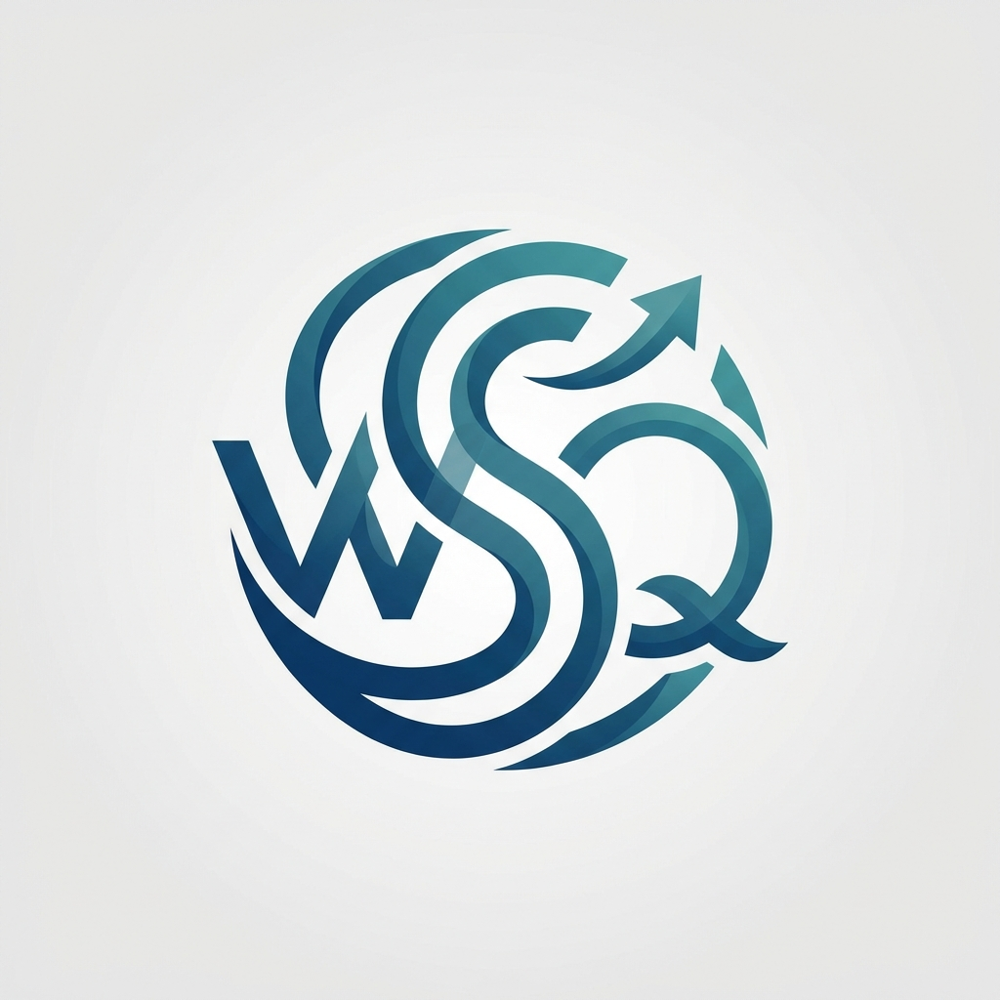

# 团队成员
- 
- [绳璨泽](./团队成员自我介绍/绳璨泽.md)
- 钱河辰

# 团队logo

# 团队logo介绍
- ✨ 设计理念
- 成员联结：将 W、S、Q 三个首字母巧妙交织，让每个成员都能在 Logo 中找到自己的标识，强化团队归属感。
- 进步表达：通过箭头、螺旋上升的视觉语言，把抽象的 “进步” 转化为具象符号，传递 “在协作中学习、在实践中成长” 的团队精神。
- 风格适配：采用现代简约的扁平化渐变风格，既符合软件工程的专业感，又适配游戏开发领域的创意调性，兼顾辨识度与美观度。
- 🛠️ 生成过程描述
- 需求提炼：以三位成员首字母 W、S、Q 为基础元素，核心关键词为 “进步”，目标是打造兼具团队标识性与精神象征的 Logo。
- 元素构思：确定将三个字母进行艺术化交织，融入箭头、螺旋等向上形态，用蓝绿色渐变体现成长感，圆形轮廓强化整体感。
